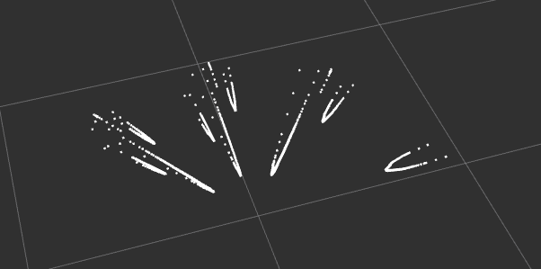

# Monocular SLAM using MIDAS depth estimation on ROS2

Welcome to the Monocular SLAM with MIDAS Depth Estimation on ROS2 repository! This project combines state-of-the-art computer vision techniques with the power of the Robot Operating System 2 (ROS 2) framework to enable monocular Simultaneous Localization and Mapping (SLAM) on a compact driving hardware platform.

## Overview

Monocular SLAM is a fundamental technology in robotics and autonomous navigation. It allows a robot to understand its environment and estimate its own position and orientation within an environment using only a single camera. This project uses MIDAS, a powerful deep learning-based depth estimation model, to generate dense depth maps from the camera's RGB images. These depth maps are then integrated into ROS2 to enable real-time SLAM, allowing our hardware platform to navigate and interact with its environment.

## Import information for the submission
Due to the fact that we used the ROS framework and some open source packages, there are a number of files that we did not create ourselves. For your convenience, here are the files that are important for submission and grading:
- [robot_direction_node](robot_control/robot_control/robot_direction_node.py)
- [server_direction_node.py](server/server/server_direction_node.py)
- [server_node.py](server/server/slam_node.py)

## Key features

**MIDAS Depth Estimation**: 
We use the MiDaS monocular depth estimation model, a convolutional neural network (CNN), which allows us to extract depth range and scale information from a single camera image. We use the MiDaS model version "v2.1 small", which runs five times faster than the regular model and allows real-time processing, so we can use it on our roboter.
The model was trained on 10 datasets, which were combined even if their annotations were incompatible. What helped this model outperform other monocular depth estimators is that, in addition to training by combining existing datasets, a new source was used: 3D movies. They provide high quality video images in all kinds of environments and content. To check the quality of the results, a so-called "zero-shot cross-dataset transfer" was used. This means that after training the model, it is tested on other datasets that were never seen during training. The idea is that this is a better example of real world performance. Midas also introduced a new loss function in their paper that helps outperform similar models.\

References:
- Ranftl, René, et al. "Towards robust monocular depth estimation: Mixing datasets for zero-shot cross-dataset transfer." IEEE transactions on pattern analysis and machine intelligence 44.3 (2020): 1623-1637
- Ranftl, René, Alexey Bochkovskiy, and Vladlen Koltun. "Vision transformers for dense prediction." Proceedings of the IEEE/CVF international conference on computer vision. 2021.

**ROS 2 Integration**: 
The project is based on the ROS 2 framework, which provides a flexible and modular architecture for robotics applications. We are using ROS 2 primarily to provide seamless communication between the different components of the system, making it easier to develop, test and deploy.
The ROS 2 framework is great for the project because there are a few things we do not have to worry about when using ROS:
- Networking and communication between the robot and a computer: With ROS2 they just need to be on the same network and we can send ROS messages between them.
- Multithreading and modularity: In ROS each process is represented by a node. ROS nodes are autonomous processes that perform specific tasks or functions and communicate with each other using the ROS communication infrastructure. Each node can be started and stopped individually. 
  
There are a few packages here that we have not written ourselves. These are open-source packages for reading our USB camera and, more importantly, sending it as a ROS message type, so that we can access it from a different node and don't have to worry about threading or timing. All four are running on the robot.
- image_common: https://github.com/ros-perception/image_common
- image_pipeline: https://github.com/ros-perception/image_pipeline
- opencv-cam: https://github.com/clydemcqueen/opencv_cam
- ros2_shared: https://github.com/ptrmu/ros2_shared
  
The robot_control package runs on the robot's Rasberry Pi and is used to control the motors. It receives control commands from the server package, also via the ROS messaging system.
The server package runs on a computer on the same network as the Raspberry Pi. We use this to do some of the heavy lifting, so the robot does not need to load an NN or visualize and save the map. 
For visualization, we use [RViz](http://wiki.ros.org/rviz). More specifically, we use a point cloud that we send via a message for RViz to display. 

**Monocular SLAM**:
SLAM stands for Simultaneous Localisation and Mapping and is a key concept in robotics, especially in relation to autonomous robots and self-driving vehicles. SLAM is a process in which a robot or autonomous system determines its own position in an unknown environment and simultaneously creates a map of that environment.
By combining depth estimation with visual odometry, our system performs monocular SLAM, enabling the hardware platform to create maps of its environment while simultaneously localizing itself within those maps.

## Proof of Work
Before we started working on the live monocular SLAM, we did a proof of concept to make sure that our idea would work.
We took four images manually over an 80-degree span and used the same script to estimate the depth. We saved the resulting depth values from this calculation in a file.\
   \
Later we read this file into the visualisation script. There we hard-coded the angle that each image was taken from, did some triangulation, and sent the resulting point cloud to RViz.\

