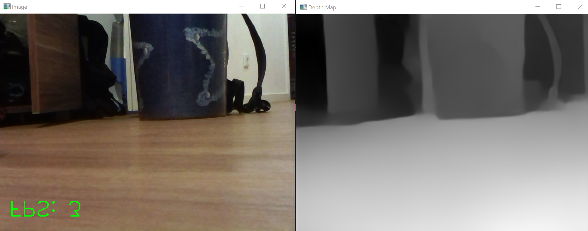

# Monocular SLAM with MIDAS Depth Estimation on ROS 2

Welcome to the Monocular SLAM with MIDAS Depth Estimation on ROS 2 repository! This project combines state-of-the-art computer vision techniques with the power of the Robot Operating System 2 (ROS 2) framework to enable monocular Simultaneous Localization and Mapping (SLAM) on a compact driving hardware platform.

## Overview

Monocular SLAM is a fundamental technology in the field of robotics and autonomous navigation. It allows a robot to understand its surroundings and estimate its own position and orientation within an environment using only a single camera. This project uses MIDAS, a powerful deep learning-based depth estimation model, to generate dense depth maps from the camera's RGB images. These depth maps are then integrated into ROS 2 to enable real-time SLAM, making it possible for our hardware platform to navigate and interact with its environment autonomously.

## Key Features

**MIDAS Depth Estimation**: 
We utilize the MIDAS model, a deep neural network designed for monocular depth estimation, to create accurate depth maps from a single camera feed.

**ROS 2 Integration**: 
The project is built on the ROS 2 framework, providing a flexible and modular architecture for robotics applications. We use ROS 2 mostly for the seamless communication between various components of the system, making it easier to develop, test, and deploy.
The ROS 2 framework is great for the project because we do not need to worry about a few things:
- Networking and communication between the robot and a Computer: With ROS2 they simply need to be in the same Network and we can send ROS messages between them.
- Multithreading and modularity: In ROS every process is represented by a Node. ROS nodes are autonomous processes that perform specific tasks or functions and communicate with each other using the ROS communication infrastructure. You can start and stop each node individually. 
  
There are a few packages here that we did not write ourselves. These are open-source packages to read our USB-Camera and more importantly send them as a ROS message type, that way we can access them from a different Node and don't need to worry about threading or timing. All four of them run on the Robot.
- image_common: https://github.com/ros-perception/image_common
- image_pipeline: https://github.com/ros-perception/image_pipeline
- opencv-cam: https://github.com/clydemcqueen/opencv_cam
- ros2_shared: https://github.com/ptrmu/ros2_shared
  
The Package "robot_control" runs on the Rasberry Pi of the Robot and is used to control the Motors. It receives control commands from the server Package, also over the ROS message system.
The Server Package runs on a Computer, that is in the same Network as the Raspberry Pi. We use this to do some heavy lifting, that way the Robot does not need to load an NN or Visualize and save the map. 
For the Visualization, we utilize [RViz](http://wiki.ros.org/rviz). More specifically we use a Pointcloud that we send over a message for RViz to show. 

**Monocular SLAM**: 
By combining depth estimation with visual odometry, our system performs monocular SLAM, enabling the hardware platform to create maps of its environment while simultaneously localizing itself within those maps.

## Proof of Work
Before we started working doing the monocular SLAM live, we did a Proof of work to make sure our Idea would be able to achieve results.
We took four pictures manually, over a span of 80 degrees, and used the same script for depth estimation. We saved the resulting depth values from that calculation in a file.\
   \
Later we read that File in the Visualisation script. There we hard-coded the corresponding angle that each picture was taking in, did some triangulation, and sent the resulting pointcloud we created, to RViz.\
\

